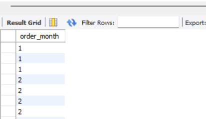
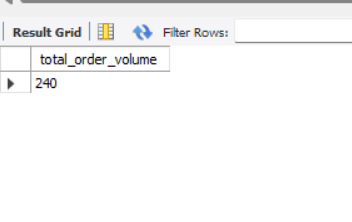
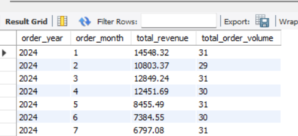
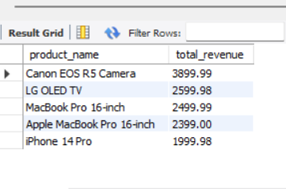
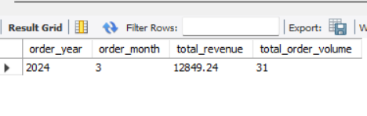

# 📊 Online Sales Data SQL Analysis

This project demonstrates SQL operations on an online sales dataset, including extracting dates, grouping, summarizing revenue, calculating order volume, sorting results, and filtering by specific time periods.

---

## 📁 Database Setup

sql
CREATE DATABASE online_sales;
USE online_sales;
SELECT * FROM online_sales;

---

## ✅ Task-wise SQL Breakdown

### 🟢 a. Extract Month from Order Date

We use the EXTRACT() function to get the month from each order date:

sql
SELECT EXTRACT(MONTH FROM Date) AS order_month
FROM online_sales;

---

### 🟡 b. Group by Year and Month

This query helps in monthly reporting by grouping data by both year and month:

sql
SELECT
    EXTRACT(YEAR FROM Date) AS order_year,
    EXTRACT(MONTH FROM Date) AS order_month
FROM online_sales
GROUP BY order_year, order_month;

---

### 🔺 c. Calculate Total Revenue using SUM()

The total revenue is computed using SUM() over the Total Revenue column:

sql
SELECT
    SUM(Total Revenue) AS total_revenue
FROM online_sales;

---

### 🔴 d. Count Distinct Orders (Volume)

Each unique Transaction ID represents an order, so we use COUNT(DISTINCT ...) to get order volume:

sql
SELECT
    COUNT(DISTINCT Transaction ID) AS total_order_volume
FROM online_sales;

#### 📅 Monthly Revenue and Volume:

sql
SELECT
    EXTRACT(YEAR FROM Date) AS order_year,
    EXTRACT(MONTH FROM Date) AS order_month,
    SUM(Total Revenue) AS total_revenue,
    COUNT(DISTINCT Transaction ID) AS total_order_volume
FROM online_sales
GROUP BY order_year, order_month
ORDER BY order_year, order_month;

---

### 👣 e. Sort Results using ORDER BY

#### Top Revenue-Generating Categories:

sql
SELECT
    Product Category,
    SUM(Total Revenue) AS total_revenue
FROM online_sales
GROUP BY Product Category
ORDER BY total_revenue DESC;

#### Top 5 Best-Selling Products:

sql
SELECT
    Product Name,
    SUM(Total Revenue) AS total_revenue
FROM online_sales
GROUP BY Product Name
ORDER BY total_revenue DESC
LIMIT 5;

---

### 👢 f. Limit Results for a Specific Time Period

#### Example: Only orders from March 2024:

sql
SELECT
    EXTRACT(YEAR FROM Date) AS order_year,
    EXTRACT(MONTH FROM Date) AS order_month,
    SUM(Total Revenue) AS total_revenue,
    COUNT(DISTINCT Transaction ID) AS total_order_volume
FROM online_sales
WHERE Date >= '2024-03-01' AND Date < '2024-04-01'
GROUP BY order_year, order_month
ORDER BY order_year, order_month;

---

## 📷 Screenshots

Include visual snapshots of the following:
1. Top 5 products by revenue
2. Monthly revenue trend table
3. Revenue by product category chart
4. Filtered result for March 2024

---

## 💡 Summary

This project demonstrates how to:
- Use SQL's date functions (EXTRACT)
- Group and aggregate data using GROUP BY, SUM(), COUNT()
- Sort results with ORDER BY
- Filter records for specific periods using WHERE
